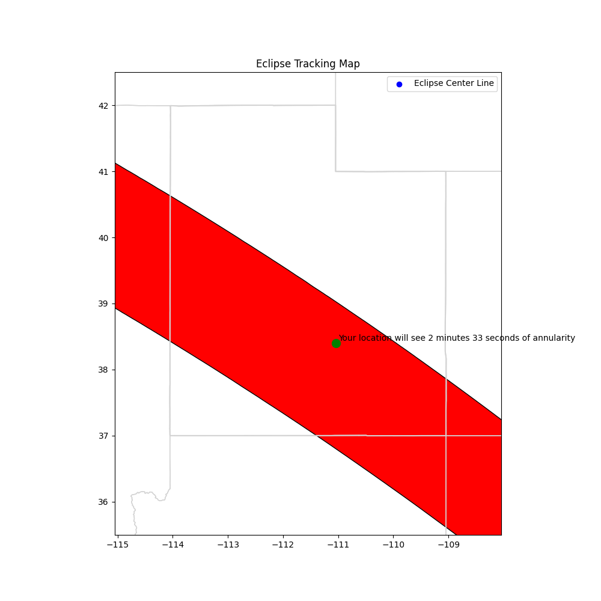
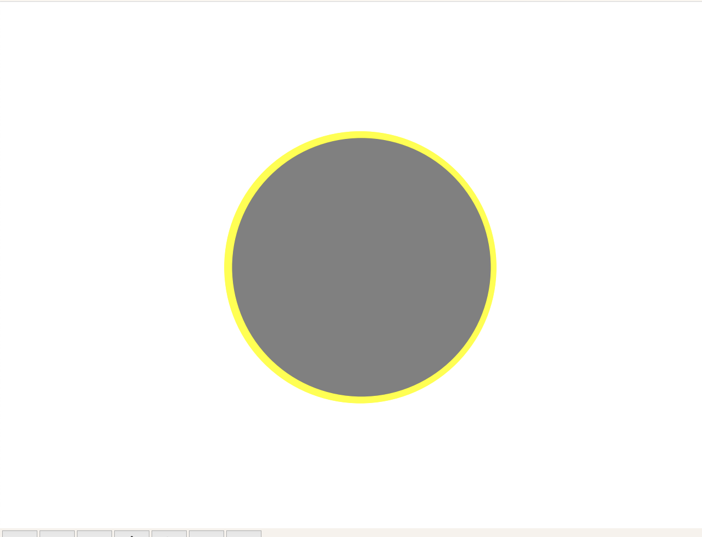
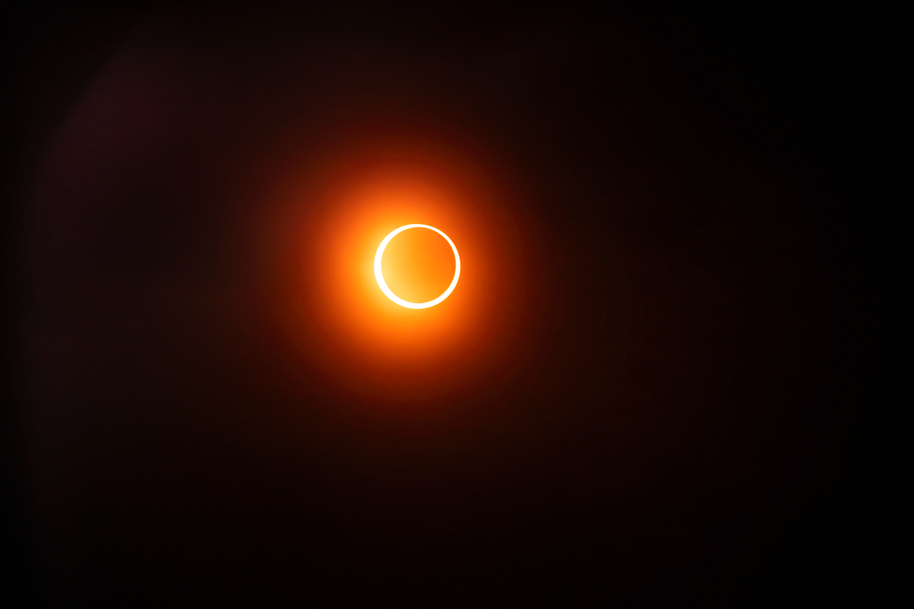

# eclipse_planner
Find the perfect spot with the best window of annularity for the upcoming 2023 eclipse 

*Modified to work with an Adafruit Ultimate GPS module for offline raspberry pi use*
`https://www.adafruit.com/product/746`

## Download and Setup Instructions

1. Click on the following link to download the required file: [Download 2023eclipse_shapefiles.zip](https://svs.gsfc.nasa.gov/vis/a000000/a005000/a005073/2023eclipse_shapefiles.zip)
2. Once downloaded, unzip the file.
3. Move the unzipped files to the `data` directory in your project folder.

After completing the above steps, you should be ready to run the project. Its important to note that the duration displayed on the map is **For Annularity Only** the eclipse will actually last much longer in a given area. 


## Running the Code

To track the eclipse based on a given location, use the script provided in the project. The `separation_degrees` variable will control how much of sun coverage for annularity, closer to 0 is full coverage (not possible with an annular eclipse, but close to 0) currently set to `0.01`.

```
python eclipse_tracker.py "Your Location Name"
```



<div style="display: flex; justify-content: space-between;">
    <div style="flex-basis: 48%;">
        <p align="center"><br />Predited Eclipse</p>
    </div>
    <div style="flex-basis: 55%;">
        <p align="center"><br />Actual Eclipse</p>
    </div>
</div>
