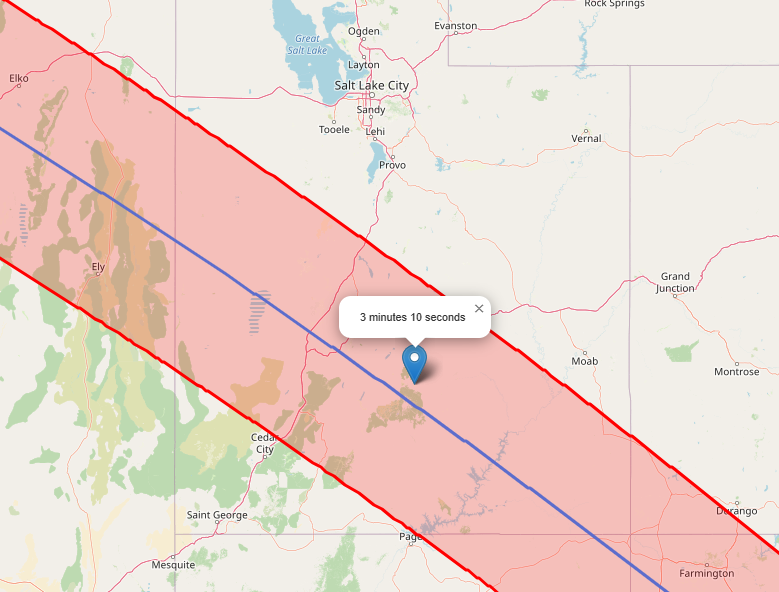

# eclipse_planner
Find the perfect spot with the best window of annularity for the upcoming 2023 eclipse 

## Download and Setup Instructions

1. Click on the following link to download the required file: [Download 2023eclipse_shapefiles.zip](https://svs.gsfc.nasa.gov/vis/a000000/a005000/a005073/2023eclipse_shapefiles.zip)
2. Once downloaded, unzip the file.
3. Move the unzipped files to the `data` directory in your project folder.

After completing the above steps, you should be ready to run the project.

## Running the Code

To track the eclipse based on a given location, use the script provided in the project. Here's the outline of the script:

```
python eclipse_tracker.py "Your Location Name"
```


